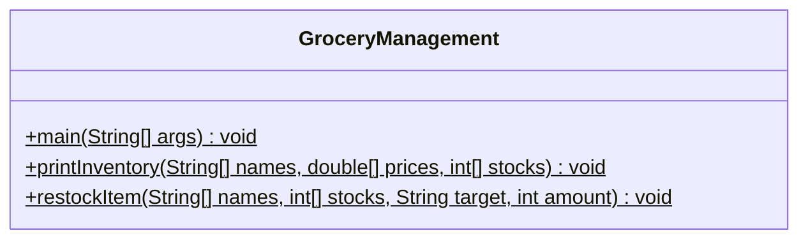
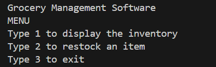
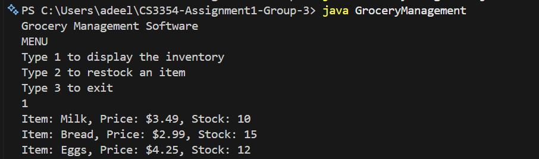
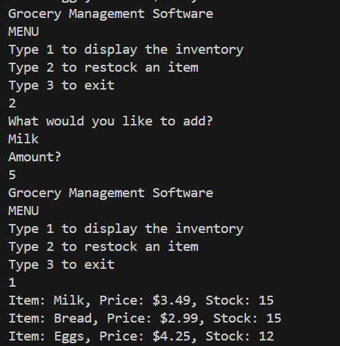
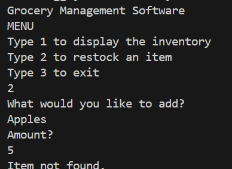
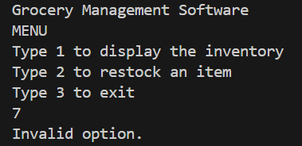

# CS3354-Assignment1-Group-3
CS 3354 Group Assignment 1 - Grocery Management System

A simple Java console application for managing grocery inventory using
parallel arrays. Users can view current stock, restock items, and exit
through a text menu.

## Description

Item names, prices, and stock counts are tracked across three parallel
arrays, where the same index in each array refers to the same item.

## How It Works

The program runs a menu in a loop until the user exits:

- **1 – Display inventory:** `printInventory` loops through the arrays and
  prints each item's name, price, and stock. Empty slots are skipped.
- **2 – Restock an item:** the user enters an item name and an amount.
  `restockItem` searches for a matching name and adds the amount to its
  stock. If no item matches, it prints `Item not found.`
- **3 – Exit:** ends the program.

Entering any other number prints `Invalid option.`


## How to Run

```
javac GroceryManagement.java
java GroceryManagement
```

Follow the on-screen menu to view inventory (1), restock an item (2),
or exit (3).


## UML Class Diagram




## Documentation

Generated Javadoc is available in the `docs/` folder. Open `docs/index.html`
in a browser to view it.

## Team Members & Tasks

| Name | GitHub | Branch | Contribution |
|---|---|---|---|
| Sakar Pandey | sakarpandey093-tech | feature-display | Created the repo; wrote `printInventory` |
| Johnny Reed | johnnyer577 | feature-restock | Wrote `restockItem` (search and restock) |
| Danylo Huk | h3ccc | feature-menu | Wrote the Scanner menu loop in `main` |
| Niruta Chataut | nirutachataut | feature-javadoc | Wrote and generated Javadoc into `docs/` |
| Mohamed Adeel Rahman | adeelrahman | feature-test | Wrote class/method Javadoc; tested the merged program; Revised README |


## Screenshots

### Program menu


### Displaying the inventory


### Restocking an item


### Item not found


### Invalid menu option
